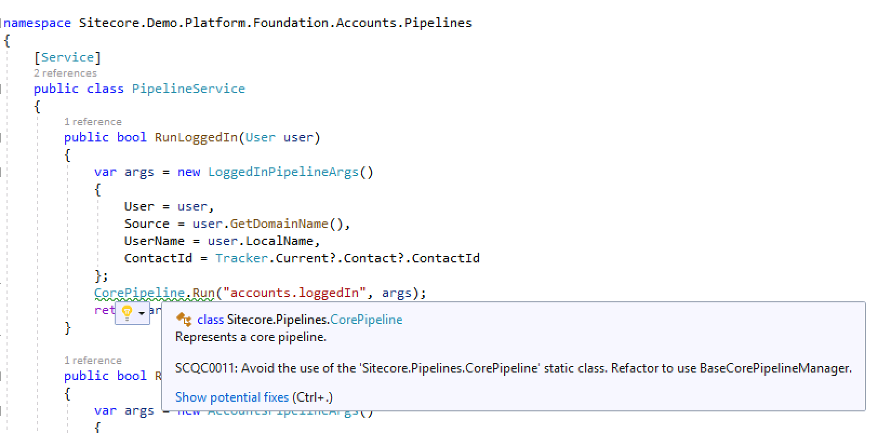

With this post, I introduce a set of Roslyn analyzers for Sitecore. The goal for this project was to get more control on code quality, to be more aware of less optimal code constructions in Sitecore, and in the end, it will give you the possibility to write better unit tests.

## What is Roslyn Analyzers

Roslyn-based analyzers use the .NET Compiler SDK (Roslyn APIs) to analyze your project's source code to find issues. They can be available as NuGet packages and Visual Studio extensions. With rulesets, you can set up the set of rules you want to comply with. How you do this in an effective way I wrote in a previous post about [controlling rulesets with NuGet packages](/using-nuget-to-control-fxcop-rulesets). The set analyzers that are released now are only available as a NuGet package. The advantage of NuGet packages is that they also can be used in continuous integration scenarios. Whereas the Visual Studio extension only can be used within Visual Studio.

## Why using Analyzers with Sitecore

Over the years Sitecore changed little by little. In the past, there were a lot of static classes, which are not ideal from a design and unit test perspective. This changed some versions ago. Sitecore introduced a set of abstractions as an alternative. Despite this change, still many developers use those static classes. Even in recent [Sitecore Demo](https://github.com/Sitecore/Sitecore.Demo.Platform) projects these static classes often are used. Although everybody knows these aren't starter kits, these analyzers will show why.

### Sitecore's Static Classes vs. Abstract Classes

To improve the testability of your custom Sitecore it's a good practice to don't use static classes. Sitecore has quite a few of them. To avoid these the analyzers will show you warnings when using Sitecore static classes and tell you which base class you should inject. 

Many of these static classes are not regularly used, but some may be used quite often. For example: `Log`, `LinkManager`, `Settings` and `TemplateManager`. The full list of static classes that should be replaced by a base class can be found in the [documentation of the package](https://github.com/TheRoks/Sitecore.Analyzers/blob/main/src/TheRoks.Sitecore.Analyzers/AnalyzerReleases.Shipped.md).

In many cases, static classes easily can be replaced by the base class alternative without losing any functionality. It always improves testability and design. All base classes are registered as singleton, so there are no concerns regarding hidden singletons. If you want to see the complete list of the currently registered, along with its scope and type visit `/sitecore/admin/showservicesconfig.aspx`.

### Potential Performance Issues

There are some Sitecore code constructs, that makes you always curious about the performance in real-world scenarios. So you'll get warnings when using `Axes.GetDescendants()` or `SelectItems(string xpath)`. Most of the time there's a good alternative available like search. If it's not, you may suppress the rule with a good reason and your colleagues know why you think it's a good idea to use it.

### Exception handling

Good troubleshooting comes with proper logging. So there are checks on good usages of error logging. For example, if you catch an exception be sure that you'll add a Sitecore log error action. Also, the analyzers will check if you include the exception in the log. The goal of these rules is to never swallow an exception. Clear and useful logging is critical in troubleshooting scenarios. These rules try to prevent you miss logging on the moment you'll have to troubleshoot.

### Helix Rules

There are rules about Helix architecture. This enforces layer architecture and the dependencies between features. These rules are still a little bit of work in progress. It looks for references between the layers. In later versions, there will be checks added for Helix.

## How to use Roslyn analyzers

These analyzers are available as a [NuGet package](https://www.nuget.org/packages/TheRoks.Sitecore.Analyzers/). You install the package in all Sitecore projects. After installing Visual Studio will execute them in the background (if you didn't disable background analysis) and shows warnings in the error pane. Using a ruleset configuration file, or an editorconfig file you [disable or change the severity of the rules](https://docs.microsoft.com/en-us/visualstudio/code-quality/use-roslyn-analyzers?view=vs-2019).

A full list of all rules (and their IDs) can be found on [GitHub](https://github.com/TheRoks/Sitecore.Analyzers/blob/main/src/TheRoks.Sitecore.Analyzers/AnalyzerReleases.Shipped.md).

## Summary

Roslyn analyzers are an easy way to give developers an early heads-up about code quality. Optionally you can prevent compiling specific code constructs by using rulesets.
