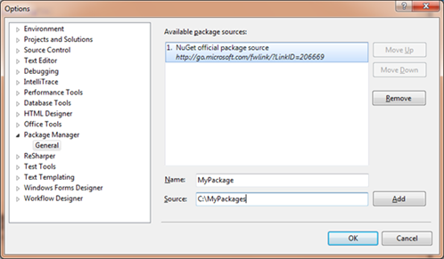

NuGet is a package manager that simplifies the process of discovering, installing and using third-parties .NET libraries. It is free to download, open source and you are able to create your own package and submit them. In this post I’ll show how to create your own package and host them yourself.

## Requirements

* Visual Studio 2010
* Powershell 2.0

## How to create a package

First of all create a solution with the code you want to distribute.A package consists of three types of files: tools, assemblies, and content. The type (or function) of a file is determined by where in the package folder structure it is located. This in turn determines what NuGet does with the file during package installation. (File types are not specified in the.nuspec file.)

* Tools – The tools folder of a package is for programs that you want to be accessible from the command line. After the folder is copied to the target project, it is added to the $env:Path (PATH) environment variable.
* Assemblies (.dll files) in the lib folder become assembly references when the package is installed.
* Content – All other files are copied to the application root when the package is installed.

## Supporting Multiple .NET Framework Versions and Profiles

Many libraries target a specific version of the .NET Framework. For example, you might have one version of your library that’s specific to Silverlight, and another version of the same library that takes advantage of .NET Framework 4 features. You do not need to create separate packages for each of these versions. NuGet supports putting multiple versions of the same library in a single package keeping them in separate folders within the package. When NuGet installs an assembly from a package, it checks the target .NET Framework version of the project you are adding the package to. NuGet then selects the correct version of the assembly in the package by selecting the correct subfolder within the lib folder. To enable NuGet to do this, you use the following naming convention to indicate which assemblies go with which framework versions:

lib{framework name}{version}

## The .nuspec Manifest File

After files are arranged in a package folder structure, you create the .nuspec
XML file that provides metadata for the package. The following example shows a simple
.nuspec file:

```xml
<?xml version="1.0" encoding="utf-8"?>
<package>
  <metadata>
    <id>NuGetDemoPackage</id>
    <version>1.0.0</version>
    <authors>TheRoks</authors>
    <description>Description of the package.</description>
    <language>en-US</language>
  </metadata>
</package>
```

## Configuration file transformations

To apply a configuration-file transformation, you add a file to your package’s content
and give it the same name as the file you want to transform, followed by a .transform
extension. For example, to transform a web.config file, you create a web.config.transform
file. The transformation file contains XML that looks like a web.config
or app.config file, but it includes only the sections that need to be merged
into the project’s configuration file.

For example this is the key you want to add.

```xml
<?xml version="1.0" encoding="utf-8" ?>
<configuration>
  <appSettings>
    <add key="myKey" value="something"/>
  </appSettings>
</configuration>
```

After the NuGet package is installed this key will be included in the appSettings.

## Source-code transformations

NuGet also supports source-code transformations that work somewhat like Visual Studio
project templates. These transformations are useful if your NuGet package includes
source code to be added to the project it's installed in. For example, you might
want to include source code that's used to initialize your library, but you want
the code to exist in the target project’s namespace.

You specify a source code transformation by including Visual Studio project properties
in the code. The properties are delimited using dollar signs ($). For example, suppose
you want to specify that the target project’s root namespace should be inserted
into the namespace statement. The source code that you include in the project might
look like the following example (the rootnamespace project property is highlighted):

```csharp
namespace $rootnamespace$.Models {
    public struct CategoryInfo {
        public string categoryid;
        public string description;
        public string htmlUrl;
        public string rssUrl;
        public string title;
    }
}
```

Run a command to create the package

After package files are in the proper folders and the .nuspec file has
been created, you run the
nuget.exe command-line utility and pass it the name of the.nuspec
file. The following example shows a nuget.exe command that creates a NuGet
package:

```nuget pack NuGetDemoPackage.nuspec –b c:\nugetdemopackage  -o c:\nugetdemopackage-nuget```

The pack command is followed by the name of the .nuspec file, an optional parameter
for the base folder that contains the files to include in the package, and an optional
parameter for the folder to create the package in. When you execute this command,
a file named nugetdemopackage.1.0.0.nupkg is created in the nugetdemopackage-nuget
folder, and the console displays the following message:

Successfully created package

```c:\nugetdemopackage-nugetnugetdemopackage.1.0.0.nupkg```



Automate the creating process during a Visual Studio build process. NuGet comes
with custom buildtasks that can be used.
