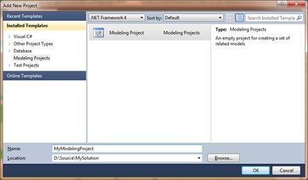
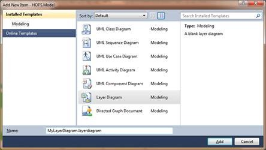
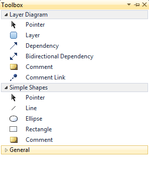
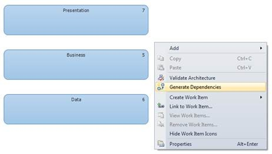
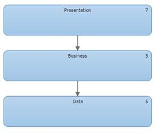
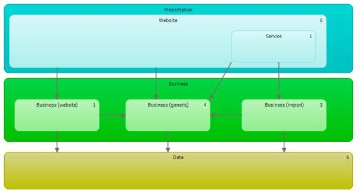

The layer diagram in the architecture tools for Visual Studio is a new type of diagram that allow you to describe the “logical” architecture of your application. Your code can be organized into different “layers”, allowing a better understanding of what objects perform what tasks. Layer diagrams can also be incorporated into the automated build process, allowing you to ensure that no architectural constraints have been violated.

## How to create a layer diagram with the architecture tools of Visual Studio 2010

Modeling projects are created as all other projects. Select New Project from menu and select Modeling Projects from templates pane. There is only one modeling project template called Modeling Project. Select it and click Ok.

New diagrams are added to model just like any other file in other projects. Just select Add new item and select item type.

Now we have several item available for modeling. Draw your layer with the layer item. You can drag artefacts from the Solution Explorer or the Architecture Explorer to create layers in various ways. Normal dragging of a single artefact onto the design service creates a new layer with a one-to-one mapping (a “link” in Layer Diagrams) from layer to artefact. This is especially useful for projects from the solution explorer. It’s not uncommon for logical layers to be implemented as tiers (or physical assemblies). Or, you can create a one-to-many mapping from layer to artefacts by normal dragging of artefacts onto the design surface. This is useful when you’re modeling layers but haven’t modeled them as tiers and multiple layers exist in a single assembly or project. Via the Architecture Explorer and the Solution Explorer you can link assemblies (projects), types, namespaces, methods, properties, fields, and files to a layer.

After that you can draw the depencies as you want them to be or when you have already a solution you can choose for generate dependencies.

This will draw the lines between the layer as they are implemented.

This is just a small example of layer designing after that you can go further and more in detail.

Once a layer model has been defined, you can then ask Visual Studio to validate the solution against that logical architecture. Within the layer diagram you can have a one-to-one mapping of layer to links, or a one-to-many mapping. i.e. a layer can consist of one or more links (at least in terms of validation—you can have zero links in a layer if you want; but then VS has no information with which to validate anything). If, for whatever reason, the current solution doesn’t follow the logical architecture, an error will result. You can also configure the solution to automatically validate the solution against the layer diagram during a build. This build-time validate can occur in both the Ultimate and Premiums editions of Visual Studio 2010.

Default layers can be downloaded here from patterns and practices. This package gives a architecture layout of five different types of applications. Web Application, Rich Client Application, Rich Internet Application, Services Application and Mobile Application.
