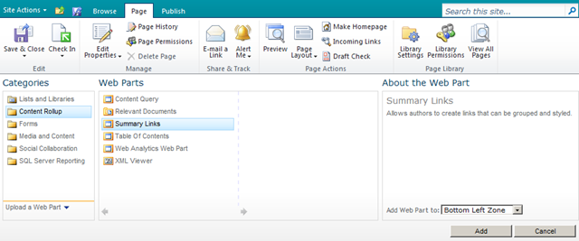
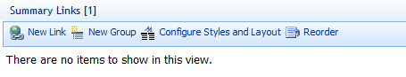
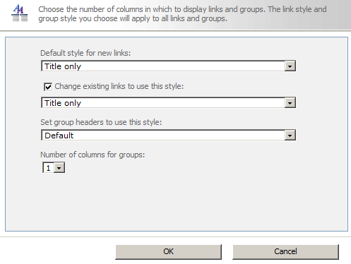
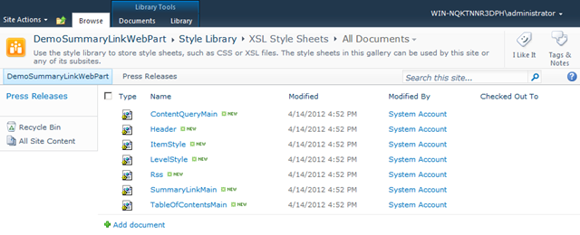
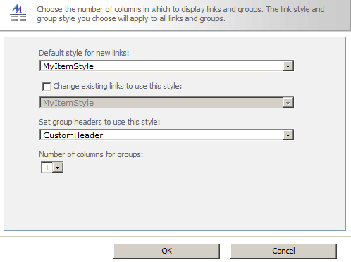

The SummaryLinkWebPart has many styles in it, but if you need to brand it to your company’s then you can add custom styles.

## Introduction to SummaryLinkWebPart

Add the webpart. It is in the category Content Rollup. See on MSDN what you can do with this webpart.





Configure styles and layout to set the layout of your style.


## Configuring SummaryLinkWebPart

Next you do an export of the webpart. In the file you can add custom links to stylesheets.

```xml
<property name="HeaderXslLink" type="string" />
<property name="MainXslLink" type="string" />
<property name="ItemXslLink" type="string" />
```

Customizing XSL stylesheets

This stylesheets are located in the stylelibrary. Take a copy of them to see how SharePoint created this files.



The custom stylesheet can be very simple.

MyHeader.xsl

```xml
<xsl:stylesheet
  version="1.0"
  exclude-result-prefixes="x d ddwrt xsl msxsl"
  xmlns:x="http://www.w3.org/2001/XMLSchema"
  xmlns:d="http://schemas.microsoft.com/sharepoint/dsp"
  xmlns:ddwrt="http://schemas.microsoft.com/WebParts/v2/DataView/runtime"
  xmlns:xsl="http://www.w3.org/1999/XSL/Transform"
  xmlns:msxsl="urn:schemas-microsoft-com:xslt">
  <xsl:template name="CustomHeader" match="*" mode="header">
    <h2>
      <xsl:call-template name="OuterTemplate.GetGroupName">
        <xsl:with-param name="GroupName" select="@*[name()=$Group]"/>
        <xsl:with-param name="GroupType" select="$GroupType"/>
      </xsl:call-template>
    </h2>
  </xsl:template>
</xsl:stylesheet>
```

MyItemStyle.xsl

```xml
<xsl:stylesheet
  version="1.0"
  exclude-result-prefixes="x d xsl msxsl cmswrt"
  xmlns:x="http://www.w3.org/2001/XMLSchema"
  xmlns:d="http://schemas.microsoft.com/sharepoint/dsp"
  xmlns:cmswrt="http://schemas.microsoft.com/WebParts/v3/Publishing/runtime"
  xmlns:xsl="http://www.w3.org/1999/XSL/Transform" xmlns:msxsl="urn:schemas-microsoft-com:xslt">
  <xsl:param name="ItemsHaveStreams">
    <xsl:value-of select="'False'" />
  </xsl:param>
  <xsl:variable name="OnClickTargetAttribute" 
    select="string('javascript:this.target=&quot;_blank&quot;')" />
  <xsl:variable name="ImageWidth" />
  <xsl:variable name="ImageHeight" />
  <xsl:template name="MyItemStyle" match="Row[@Style='MyItemStyle']" mode="itemstyle">
    <xsl:variable name="SafeLinkUrl">
    <xsl:call-template name="OuterTemplate.GetSafeLink">
      <xsl:with-param name="UrlColumnName" select="'LinkUrl'"/>
    </xsl:call-template>
  </xsl:variable>
  <xsl:variable name="DisplayTitle">
    <xsl:call-template name="OuterTemplate.GetTitle">
      <xsl:with-param name="Title" select="@Title"/>
      <xsl:with-param name="UrlColumnName" select="'LinkUrl'"/>
    </xsl:call-template>
  </xsl:variable>
  <li>
  <xsl:call-template name="OuterTemplate.CallPresenceStatusIconTemplate"/>
    <a href="{$SafeLinkUrl}" title="{@LinkToolTip}">
      <xsl:if test="$ItemsHaveStreams = 'True'">
        <xsl:attribute name="onclick">
          <xsl:value-of select="@OnClickForWebRendering"/>
      </xsl:attribute>
      </xsl:if>
      <xsl:if test="$ItemsHaveStreams != 'True' and @OpenInNewWindow = 'True'">
        <xsl:attribute name="onclick">
          <xsl:value-of disable-output-escaping="yes" select="$OnClickTargetAttribute"/>
        </xsl:attribute>
      </xsl:if>
      <xsl:value-of select="$DisplayTitle"/>
    </a>
  </li>
  </xsl:template>
</xsl:stylesheet>
```

Create webpart file

Next we upload the custom styles and make a reference to the custom stylesheet in the webpart file.

```xml
<property name="HeaderXslLink" type="string">/Style%20Library/XSL%20Style%20Sheets/MyHeader.xsl</property>
<property name="MainXslLink" type="string">/Style%20Library/XSL%20Style%20Sheets/MySummaryLinkMain.xsl</property>
<property name="ItemXslLink" type="string" >/Style%20Library/XSL%20Style%20Sheets/MyItemStyle.xsl</property>
```

Choosing the styles in the SummaryLinkWebPart now looks like this. Only the style configured in the custom stylesheets are shown in the option list.



## Summary

This way of styling can also be applied to TableOfContents WebPart and Content Query WebPart. First time you do this it can look complicated but it is not.
