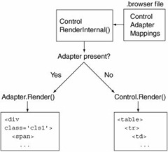

If you need to make a SharePoint site compliant and render pages without nested tables you will need to make use of a control adapter. They actually serve a purpose of providing a way of completely changing the rendering of a control based on the browser type of the client, which turns out to be useful in a number of situations.

 At their core, control adapters are simply a way of providing different renderings for controls without actually modifying the controls themselves. Because control adapters are designed to provide alternate renderings for different clients, you specify control adapter mappings in a .browser file, which is where associations between User Agent strings and browser capabilities are defined. The control adapter class itself must inherit from the System.Web.UI.Adapters.ControlAdapter, which is an abstract base class that looks much like the Control base class, with events for Init, Load, PreRender, and Unload, as well as a virtual Render method.

Starting with the web part zone and web parts.

```csharp
protected override void Render(HtmlTextWriter writer)
{
    bool inEditMode = false;
    var wpz = Control as Microsoft.SharePoint.WebPartPages.WebPartZone;
    if (wpz != null)
    {
        var swpm = (SPWebPartManager)WebPartManager.GetCurrentWebPartManager(wpz.Page);
        if (swpm != null)
        {
            inEditMode = swpm.GetDisplayMode().AllowPageDesign;
        }
    }

    if (!inEditMode)
    {
        // Render the web parts
        if (wpz.WebParts.Count > 0)
        {
            WebPartCollection wpColl = new WebPartCollection(wpz.WebParts);

            foreach (System.Web.UI.WebControls.WebParts.WebPart wp in wpColl)
            {
                wp.RenderControl(writer);
            }
        }
    }
    else
    {
        // If we are editing the page --> render the web part as usual.
        base.Render(writer);
    }
}
```

## Binding the Control Adapter

Next thing you have to do is to the this code executed. This can be done by using the .browser file.

```xml
<browser refID="default">
<controlAdapters>
  <adapter controlType="System.Web.UI.WebControls.WebParts.WebPartZone"
    adapterType="TheRoks.DemoControlAdapters.WebPartZoneControlAdapter,     TheRoks.DemoControlAdapters, 
    Version=1.0.0.0, Culture=neutral, PublicKeyToken=dd6b429e07b7058f" />
  </controlAdapters>
</browser>
```

## Binding in the master page

However, you could also bind the control adapter by adding some code behind in the master page. Note: this can only be done when using a custom master page.

This is done by using this little piece of code

```csharp
public WireframeMaster()
{
    //Add our custom branding control adapter to brand the OOB web parts
    AddControlAdapterToType(typeof(System.Web.UI.WebControls.WebParts.WebPartZone));
}

private static void AddControlAdapterToType(Type controlType) where T : ControlAdapter, new()
{
    if (controlType == null)
    {
        throw new ArgumentNullException("controlType", "This argument can not be null!");
    }

    var adapters = HttpContext.Current.Request.Browser.Adapters;
    var key = controlType.AssemblyQualifiedName;
    if (!adapters.Contains(key))
    {
        var adapter = typeof (T).AssemblyQualifiedName;
        if (key != null) adapters.Add(key, adapter);
    }
}
```

Next step is to set the reference in the master

```xml
<%@ Master language="C#" Inherits="TheRoks.DemoControlAdapters.WireframeMaster, TheRoks.DemoControlAdapters, Version=1.0.0.0, Culture=neutral, PublicKeyToken=dd6b429e07b7058f" %>
```
