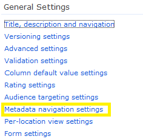
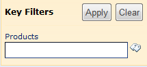

## What is Managed metadata

In short: Managed metadata is a hierarchical collection of centrally managed terms that you can define, and then use as attributes for items. In a previous post about how to provision Managed Metadata columns, I explained how Managed metadata columns can be created.

## Navigation

We’ve always been able to use folders to navigate a hierarchy in a SharePoint document library. Now we have a second option using metadata tags as additional navigation.

## Configure it

 First of all you have to activate the Metadata Navigation and Filtering site feature (MetaDataNav, 7201d6a4-a5d3-49a1-8c19-19c4bac6e668) in Site Settings. Once you’ve done this, you can configure library metadata navigation in the document library’s Settings screen. 

Metadata can be used as two different kinds of navigation:

* Hierachies
* Key filters

By default, these are shown in the left hand navigation area below the Quick Launch bar.

 Hierarchies can be displayed for any selected Managed Metadata field. In the interface users can drill down through the hierarchy of terms to filter the library contents progressively, narrowing or broadening their scope to find the right documents to display. You can display navigation for multiple managed metadata column. In addition, single value choice fields and content types can be used as additional navigational fields.

 Finally, “key filters” allow users to type in filter values for a predefined metadata column. These key filters can also be used for other field types, such as choice fields, date-time, or person fields.

Read more about Managed metadata on [MSDN](http://msdn.microsoft.com/en-us/library/ee559337(v=office.14).aspx).
