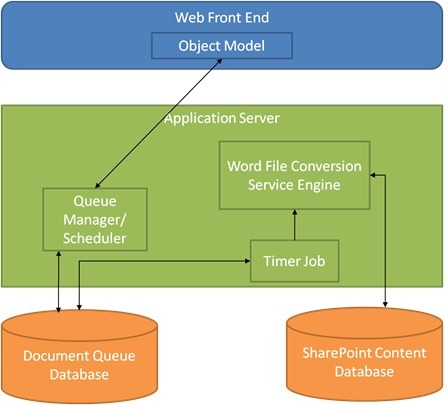

When you need to convert documents, like Word documents to PDF or XPS in SharePoint 2010 we can use the service application: Word Automation services.

## How it works

A conversion is a process in which Word Automation Services receives a file in a given format and then outputs the file in a different format. For example, the service might convert a Word 2010 document (.docx) to a PDF document.

### Source files types

* Open XML File Format documents (.docx, .docm, .dotx, .dotm).
* Word 97-2003 documents (.doc, .dot).
* Rich Text Format files (.rtf).
* Single File Web Pages (.mht, .mhtml).
* Word 2003 XML Documents (.xml).
* Word XML Document (.xml)

### Destination file types

The supported destination document formats includes all of the supported source document formats, and the following.

* Portable Document Format (.pdf)
* Open XML Paper Specification (.xps)

From the Web Front End there is a Object Model available for developers. The object model resides on a SharePoint Server 2010 Web front-end server; it enables developers to create asynchronous file conversion requests and to monitor file conversions in progress. The document queue manager resides on a back-end application server; it moves incoming requests into the document queue database and sends requests to the Word Automation Services engine for processing. A timer job controls the frequency of conversions and the number of files that are actively being converted. Both the frequency of conversions and the number of files being converted at a given time are configurable by the SharePoint administrator. For example, an administrator might pace Word Automation Services to convert only a small number of files once an hour to avoid interfering with higher-priority tasks. Document Queue is a “first in, first out”, which is used to start the conversion and that schedule can be set in the conversion job.

## Scenario

For my scenario we need to convert a Word document to a PDF. Once the PDF is created and the input document must be deleted from the server.

## The Solution

Reference Microsoft Office Word ServerBecause Word Automation Services is a service of SharePoint Server 2010, you can only use it in an application that runs directly on a SharePoint Server. You must build the application as a farm solution. You cannot use Word Automation Services from a sandboxed solution. Create a project and add reference to the Word Automation Services Object Model.

## Convert the document

Now it’s time to write some code. In example below there is a ConversionJob created.

```csharp
string siteUrl = "http://localhost";
// If you manually installed Word automation services, then replace the name
// in the following line with the name that you assigned to the service when
// you installed it.
string wordAutomationServiceName = "Word Automation Services";
using (SPSite spSite = new SPSite(siteUrl))
{
   ConversionJob job = new ConversionJob(wordAutomationServiceName);
   job.UserToken = spSite.UserToken;
   job.Settings.UpdateFields = true;
   job.Settings.OutputFormat = SaveFormat.PDF;
   job.AddFile(siteUrl + "/Shared%20Documents/Test.docx",
   siteUrl + "/Shared%20Documents/Test.pdf");
   job.Start();
}
```

## Monitor the Conversion Status

In many scenarios, you want to monitor the status of conversions, to inform the user when the conversion process is complete, or to process the converted documents in additional ways. You can use the ConversionJobStatus class to query Word Automation Services about the status of a conversion job. You pass the name of the WordServiceApplicationProxy class as a string (by default, “Word Automation Services”), and the conversion job identifier, which you can get from the ConversionJob object. You can also pass a GUID that specifies a tenant partition. However, if the SharePoint Server farm is not configured for multiple tenants, you can pass null as the argument for this parameter.

## Deleting Source Files after Conversion

```csharp
ConversionJob job = new ConversionJob(wordAutomationServiceName);
job.UserToken = spSite.UserToken;
job.Settings.UpdateFields = true;
job.Settings.OutputFormat = SaveFormat.PDF;
job.Settings.OutputSaveBehavior = SaveBehavior.AlwaysOverwrite;
SPFolder folderToConvert = spSite.RootWeb.GetFolder("Shared Documents");
job.AddFolder(folderToConvert, folderToConvert, false);
job.Start();
ConversionJobStatus status = new ConversionJobStatus(
   wordAutomationServiceName, job.JobId, null);
while (true)
{
    Thread.Sleep(5000);
    status = new ConversionJobStatus(
       wordAutomationServiceName, job.JobId, null);
    if (status.Count == status.Succeeded + status.Failed)
    {
        ReadOnlyCollection&lt;ConversionItemInfo&gt; convertedItems =
            status.GetItems(ItemTypes.Succeeded);
        foreach (var convertedItem in convertedItems)
        {
            folderToConvert.Files.Delete(convertedItem.InputFile);
        }
        break;
    }
}
```

## Conclusion

Word Automation Service offers a great conversion service. However is all happens in a batch process. Why? Conversion are very nice to have real-time. This is shown in Word Automation Service in SharePoint 2013. The new Word Automation has a few new capabilities.

Read more about Document management in SharePoint.
