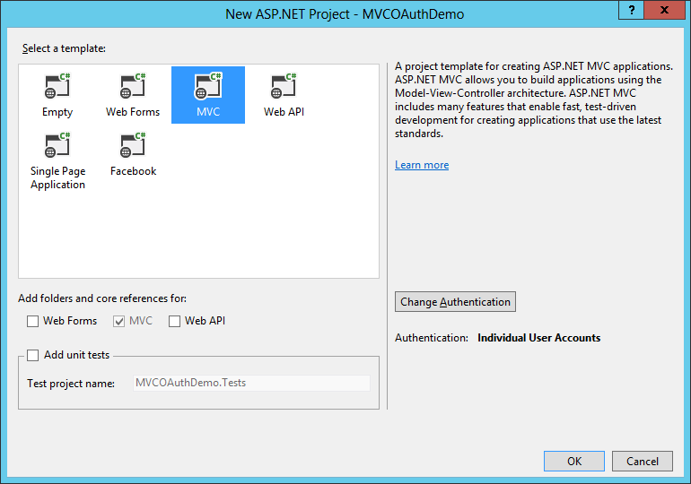
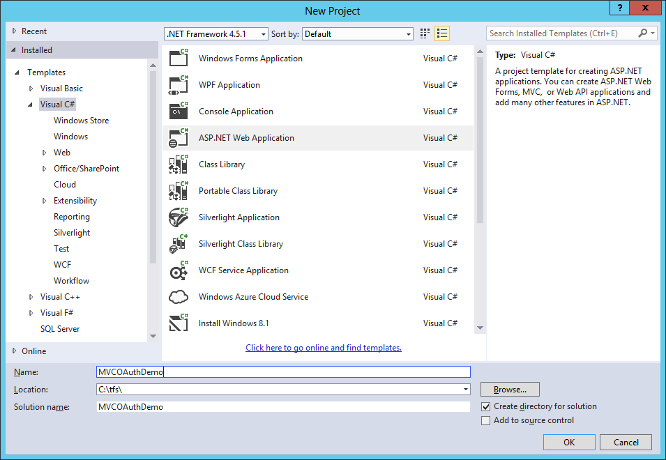
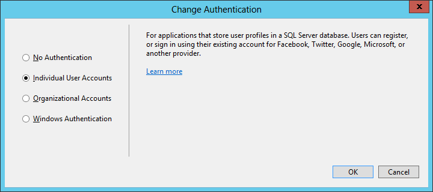
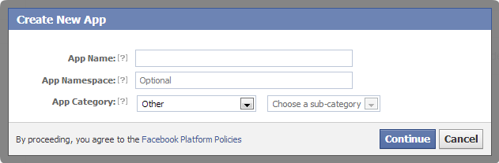

MVC5 came with some really nice stuff. In this blog post I’ll dig into the authentication with external logins as Microsoft calls them. We call them often social logins. The way this is done is quite different than in MVC4. Where MVC4 depended on webmatrix MVC5 makes use of OWIN security

## What’s OWIN

OWIN defines a standard interface between .NET web servers and web applications. The goal of the OWIN interface is to decouple server and application, encourage the development of simple modules for .NET web development, and, by being an open standard, stimulate the open source ecosystem of .NET web development tools.

The new security feature design for MVC 5 is based on OWIN authentication middleware. The benefit for it is that security feature can be shared by other components that can be hosted on OWIN.

How to create MVC5 Application with OWIN authentication

A prerequisit for MVC5 is the use of Visual Studio 2013. So create there a new project.


The next window is changed since Visual Studio 2012. We are creating a MVC application so we select MVC. On the right there’s also an option to select the authentication method.



In the change authentication window we will use Individual User Accounts.



Next we go to the App_Start\Startup.Auth.cs file. In this file that on first sight isn’t very different from MVC4. In detail it’s quite different because we now the input parameter of the method is IAppBuilder that comes from OWIN security.

```csharp
public void ConfigureAuth(IAppBuilder app)
{
    // Enable the application to use a cookie to store information for the signed in user
    app.UseCookieAuthentication(new CookieAuthenticationOptions
    {
        AuthenticationType = DefaultAuthenticationTypes.ApplicationCookie,
        LoginPath = new PathString("/Account/Login")
    });
    // Use a cookie to temporarily store information about a user logging in with a third party login provider
    app.UseExternalSignInCookie(DefaultAuthenticationTypes.ExternalCookie);

    // Uncomment the following lines to enable logging in with third party login providers
    //app.UseMicrosoftAccountAuthentication(
    //    clientId: "",
    //    clientSecret: "");

    //app.UseTwitterAuthentication(
    //   consumerKey: "",
    //   consumerSecret: "");

    //app.UseFacebookAuthentication(
    //   appId: "",
    //   appSecret: "");

    //app.UseGoogleAuthentication();
}
```

Creating App in Social networks
Creating a Facebook app is done on [https://developers.facebook.com/apps](https://developers.facebook.com/apps). Click on create app.


Enter an App Name and then click Continue.

This must be unique across Facebook. The App Namespace is the part of the URL that your App will use to access the Facebook application for authentication (for example, `https://apps.facebook.com/{App Namespace}`). If you don’t specify an App Namespace, the App ID will be used for the URL. The App ID is a long system-generated number that you will see in the next step.

On the Basic Settings page for the app, set the Site  URL. You’ll use the App ID and App Secret settings in the next step.


In the image above,  Sandbox Mode is enabled, therefore you will only be able to authenticate using the email alias you have registered. Other users and test accounts will not be able to register. You can grant other Facebook accounts access to the application on the Facebook Developer Roles tab.

For Microsoft and Twitter the mechanism is used. For Microsoft you can create an app on [https://account.live.com/developers/applications](https://account.live.com/developers/applications) and for Twitter you may visit [https://dev.twitter.com/apps](https://dev.twitter.com/apps) Google doesn’t support this.

Getting more information
The App ID and App secret settings are used in the .. file

```csharp
app.UseFacebookAuthentication(
    appId: "",
    appSecret: "");
```

After this the Facebook authentication will work. But we can do more. For example getting the access token and add it to our identity claim.

```csharp
public partial class Startup
{
    // For more information on configuring authentication, please visit http://go.microsoft.com/fwlink/?LinkId=301864
    public void ConfigureAuth(IAppBuilder app)
    {
        // Enable the application to use a cookie to store information for the signed in user
        app.UseCookieAuthentication(new CookieAuthenticationOptions
        {
            AuthenticationType = DefaultAuthenticationTypes.ApplicationCookie,
            LoginPath = new PathString("/Account/Login")
        });
        // Use a cookie to temporarily store information about a user logging in with a third party login provider
        app.UseExternalSignInCookie(DefaultAuthenticationTypes.ExternalCookie);

        // Microsoft : Create application
        // https://account.live.com/developers/applications
        if (!string.IsNullOrEmpty(ConfigurationManager.AppSettings.Get("MicrosoftClientId")))
        {
            var msaccountOptions = new Microsoft.Owin.Security.MicrosoftAccount.MicrosoftAccountAuthenticationOptions()
            {
                ClientId = ConfigurationManager.AppSettings.Get("MicrosoftClientId"),
                ClientSecret = ConfigurationManager.AppSettings.Get("MicrosoftClientSecret"),
                Provider = new Microsoft.Owin.Security.MicrosoftAccount.MicrosoftAccountAuthenticationProvider()
                {
                    OnAuthenticated = (context) =>
                    {
                        context.Identity.AddClaim(new System.Security.Claims.Claim("urn:microsoftaccount:access_token", context.AccessToken, XmlSchemaString, "Microsoft"));

                        return Task.FromResult(0);
                    }
                }
            };

            app.UseMicrosoftAccountAuthentication(msaccountOptions);
        }

        // Twitter : Create a new application
        // https://dev.twitter.com/apps
        if (!string.IsNullOrEmpty(ConfigurationManager.AppSettings.Get("TwitterConsumerKey")))
        {
            var twitterOptions = new Microsoft.Owin.Security.Twitter.TwitterAuthenticationOptions
            {
                ConsumerKey = ConfigurationManager.AppSettings.Get("TwitterConsumerKey"),
                ConsumerSecret = ConfigurationManager.AppSettings.Get("TwitterConsumerSecret"),
                Provider = new Microsoft.Owin.Security.Twitter.TwitterAuthenticationProvider
                {
                    OnAuthenticated = (context) =>
                    {
                        context.Identity.AddClaim(new System.Security.Claims.Claim("urn:twitter:access_token", context.AccessToken, XmlSchemaString, "Twitter"));
                        return Task.FromResult(0);
                    }
                }
            };

            app.UseTwitterAuthentication(twitterOptions);
        }

        // Facebook : Create New App
        // https://developers.facebook.com/apps
        if (!string.IsNullOrEmpty(ConfigurationManager.AppSettings.Get("FacebookAppId")))
        {
            var facebookOptions = new Microsoft.Owin.Security.Facebook.FacebookAuthenticationOptions
            {
                AppId = ConfigurationManager.AppSettings.Get("FacebookAppId"),
                AppSecret = ConfigurationManager.AppSettings.Get("FacebookAppSecret"),
                Provider = new Microsoft.Owin.Security.Facebook.FacebookAuthenticationProvider
                {
                    OnAuthenticated = (context) =>
                    {
                        context.Identity.AddClaim(new System.Security.Claims.Claim("urn:facebook:access_token", context.AccessToken, XmlSchemaString, "Facebook"));
                        foreach (var x in context.User)
                        {
                            var claimType = string.Format("urn:facebook:{0}", x.Key);
                            string claimValue = x.Value.ToString();
                            if (!context.Identity.HasClaim(claimType, claimValue))
                                context.Identity.AddClaim(new System.Security.Claims.Claim(claimType, claimValue, XmlSchemaString, "Facebook"));

                        }
                        return Task.FromResult(0);
                    }
                }
            };
            facebookOptions.Scope.Add("email");
            app.UseFacebookAuthentication(facebookOptions);
        }
    }

    const string XmlSchemaString = "http://www.w3.org/2001/XMLSchema#string";
}
```

Besides the access token the social networks provide you much more information about your users like first name, last name and email addresses. By having the access token you can always access these information without authentication of the users that will login in.

## Save access tokens

Saving the access tokens is done in the AccountController. Stored the access token when authenticating in the step above, now it’s time to save it. First we create a new method.

```csharp
private async Task SaveAccessToken(ApplicationUser user, ClaimsIdentity identity)
{
    var userclaims = await UserManager.GetClaimsAsync(user.Id);

    foreach (var at in (
        from claims in identity.Claims
        where claims.Type.EndsWith("access_token")
        select new Claim(claims.Type, claims.Value, claims.ValueType, claims.Issuer)))
    {

        if (!userclaims.Contains(at))
        {
            await UserManager.AddClaimAsync(user.Id, at);
        }
    }
}
```

This code is called in the SignInAsync method. This is already existing we make some little changes

```csharp
private async Task SignInAsync(ApplicationUser user, bool isPersistent)
{
    AuthenticationManager.SignOut(DefaultAuthenticationTypes.ExternalCookie);
    var identity = await UserManager.CreateIdentityAsync(user, DefaultAuthenticationTypes.ApplicationCookie);

    await SetExternalProperties(identity);

    AuthenticationManager.SignIn(new AuthenticationProperties() { IsPersistent = isPersistent }, identity);

    await SaveAccessToken(user, identity);
}
```

Update 16-02-2014

```csharp
private async Task SetExternalProperties(ClaimsIdentity identity)
{
    // get external claims captured in Startup.ConfigureAuth
    ClaimsIdentity ext = await AuthenticationManager.GetExternalIdentityAsync(DefaultAuthenticationTypes.ExternalCookie);

    if (ext != null)
    {
        var ignoreClaim = "http://schemas.xmlsoap.org/ws/2005/05/identity/claims";
        // add external claims to identity
        foreach (var c in ext.Claims)
        {
            if (!c.Type.StartsWith(ignoreClaim))
                if (!identity.HasClaim(c.Type, c.Value))
                    identity.AddClaim(c);
        }
    }
}
```

## Conclusion

Social login with MVC5 and the support of OWIN is quite easy. Saving the access tokens let us in depended off the user, access their information. This can be useful, but be aware of the privacy rules that apply on the application.
