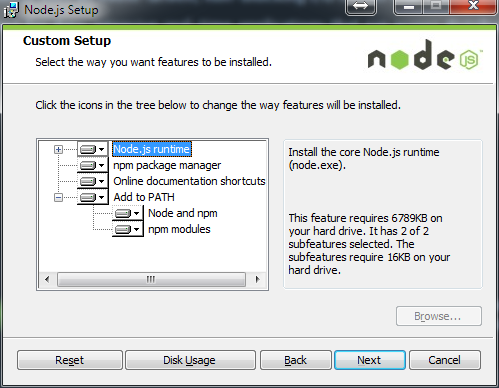

Writing e2e can be very valuable when developing clientside based web app’s. The de facto standard for writing e2e is protractor. This is since the introduction of AngularJS v1.2. The AngularJS team switched from Karma (aka scenario runner) to Protractor, Karma was used as the default e2e runner.

Protractor is based on WebdriverJS and Selenium and runs on NodeJS. The great advantage is that has knowledge about the structure of your Angular application and it is capable of using it

Running e2e tests with protractor requires some configuration and learning about how to write these tests. This document describes how to setup your environment to run e2e tests and gives a brief introduction how to write e2e tests.

## The Tools

Assuming that you’ve already got a website running. You only need the tools to run the tests to be installed. To run them we need:

* [NodeJS](http://nodejs.org): with nodeJS we will get all the necessary files to run the tests.

* [WebdriverJS](https://code.google.com/p/selenium/wiki/WebDriverJs): A javascript test runner. To run the webdriver, Java Development Kit is also need to be installed.

* [Protractor](https://github.com/angular/protractor): An end to end test framework for AngularJS applications built on top of WebDriverJS. Protractor runs tests against your application running in a real browser, interacting with it as a user would.

* [Jasmine](http://jasmine.github.io/2.0/introduction.html): A behavior-driven development framework for testing JavaScript code

## Installing

To get all the needed tooling and frameworks on your machine I used NodeJS.

### NodeJS



You can get NodeJS from its download page. Run the setup.

After this is done. You open a command line window. Type the command

```npm install -g protractor```

This will install the latest version of protractor and all its dependencies.

When this is complete we are almost done installing the tools. It depend how you want to run your tests. There are now three options. In fact there are four but that one will only run tests in Chrome. Who want’s that? Nobody!

* Running the tests on the standalone selenium server.
* Running the tests against an existing server
* Running the test in on a remote location, for protractor it would be SauceLabs.

In the first two options we will need WebdriverJS. Webdriver will send commands to the browser to run.

To install this we run the command.

```webdriver-manager update```

The selenium standalone server will be installed together with the chromedriver. With the selenium standalone driver it is possible to run tests with Chrome, Firefox and Safari. But not Internet Explorer.

## Including other browsers

Internet Explorer may not be most loved browser around webdevelopers, on the consumer market it’s still quite popular. So running tests against Internet Explorer isn’t a luxury but needed. To run tests against Internet Explorer we need to download the IEServerDriver. This one we can find on the Selenium website as a download. There are two version x86 and x64 depending on your system pick one. Put the exe file in a folder that is referenced in the system variable %PATH%. Huh, really? Yes, exactly like that.

PhantomJS is maybe unknown but is very useful for headless webtesting. Download the phantomjs.exe and put it in the same %PATH% folder as internetserverdriver.exe. An other options is to extend the Protractor config file with this if you don’t want to install PhantomJS globally.

```'phantomjs.binary.path':'./node_modules/phantomjs/bin/phantomjs',```

Your are ready to run! Let’s write our first test.

## How to write e2e tests

Let’s say we test a site that’s is somewhere online. We could be running with just to files. A Protractor config file and the test itself.

### Protractor config

Let’s first build the config file how we want to run our tests. There are many options in this config file. In this example I use a minimum set to run tests.

SeleniumServerJar: The location of the Selenium standalone .jar file on your machine. Protractor will use this to start up the selenium server.

Specs: which tests needs to run. In Protractor there are also options to create suites of the and run specific suites.

MultiCapabilities: A list of browsers. Possible values are chrome, safari, firefox, ie and phantomjs. Chrome, IE and PhantomJS require that you installed their driver. Other options that are available can be found here.

BaseUrl: A base URL for your application under test. Calls to protractor.get() with relative paths will be prepended with this.

Framework: Jasmine and Cucumber are fully supported as a test and assertion framework. Mocha has limited beta support. You will need to include your own assertion framework if working with mocha. You can use ChaiJS for that.

JasmineNodeOpts: This are Jasmine options when running tests on NodeJS.

An example config file:

```js
// A reference configuration file.
exports.config = {
    seleniumServerJar: './node_modules/protractor/selenium/selenium-server-standalone-2.40.0.jar',

    // ----- What tests to run -----
    specs: [
        'spec/*_spec.js',
    ],

    multiCapabilities: [
        {
            'browserName': 'chrome'
        },
        {
            'browserName': 'firefox'
        }
    ],

    // ----- More information for your tests ----
    baseUrl: 'http://localhost:' + (process.env.HTTP_PORT || '8000'),

    // ----- The test framework -----
    framework: 'jasmine',

    // ----- Options to be passed to minijasminenode -----
    jasmineNodeOpts: {
        // onComplete will be called just before the driver quits.
        onComplete: null,
        // If true, display spec names.
        isVerbose: false,
        // If true, print colors to the terminal.
        showColors: true,
        // If true, include stack traces in failures.
        includeStackTrace: true,
        // Default time to wait in ms before a test fails.
        defaultTimeoutInterval: 30000
    }
};
```

To see a full reference about the possibilities see also the reference config file on the site of Protractor.

## Test file

Client side tests can be written with the Jasmine or Mocha framework. Jasmine is in this time quite easier to use. There’s far more documentation for it. If you are familiar with Mocha this is also possible. I’ll continue with Jasmine.

With Protractor there is some syntactic sugar.

browser this is the a wrapper around an instance of webdriver. Used for navigation and page-wide information.

element is a helper function for finding and interacting with elements on the page you are testing.

by is a collection of element locator strategies. For example, elements can be found by CSS selector, by ID, or by the attribute they are bound to with ng-model.

protractor is the protractor namespace which wraps the webdriver namespace. This contains static variables and classes, such as protractor.Key which enumerates the codes for special keyboard signals.

### Location strategies

There are multiple ways of selecting an object on a page. But what are the tradeoffs of each of these locator types? Recall we can locate an object using

* the element’s ID
* the element’s name attribute
* an XPath statement
* by a links text
* document object model (DOM)
* by repeater
* by binding
* by model
* etc

To see the complete list with examples of location strategies, see Protractors findelement spec.

This will result in are a test. For example I took the ‘basic’ example of the AngularJS website where are some input boxes.

```js
describe('angularjs homepage', function() {
    it('should greet the named user', function() {
        browser.get('http://www.angularjs.org');

        element(by.model('yourName')).sendKeys('TheRoks');

        var greeting = element(by.binding('yourName'));

        expect(greeting.getText()).toEqual('Hello TheRoks!');
    });

    describe('todo list', function() {
        var todoList;

        beforeEach(function() {
            browser.get('http://www.angularjs.org');

            todoList = element.all(by.repeater('todo in todos'));
        });

        it('should list todos', function() {
            expect(todoList.count()).toEqual(2);
            expect(todoList.get(1).getText()).toEqual('build an angular app');
        });

        it('should add a todo', function() {
            var addTodo = element(by.model('todoText'));
            var addButton = element(by.css('[value="add"]'));

            addTodo.sendKeys('write a protractor test');
            addButton.click();

            expect(todoList.count()).toEqual(3);
            expect(todoList.get(2).getText()).toEqual('write a protractor test');
        });
    });
});
```

## Running tests

Now you installed the tools, written the tests, let’s run them! Open your command window and go to the directory of your protractor config file.

Now to run the tests type the following command.

```protractor protractor.conf.js```

## Page Object Pattern

Page Object is a Design Pattern which has become popular in test automation for enhancing test maintenance and reducing code duplication. A page object is an object-oriented class that serves as an interface to a page of your AUT. The tests then use the methods of this page object class whenever they need to interact with that page of the UI. The benefit is that if the UI changes for the page, the tests themselves don’t need to change, only the code within the page object needs to change. Subsequently all changes to support that new UI are located in one place.

The Page Object Design Pattern provides the following advantages.

1. There is clean separation between test code and page specific code such as locators (or their use if you’re using a UI map) and layout.
2. There is single repository for the services or operations offered by the page rather than having these services scattered through out the tests.

In both cases this allows any modifications required due to UI changes to all be made in one place.

## Conclusion

Protractor is still not production ready, but it is very promising by making E2E less black box testing. With its knowledge of your AngularJS app.

### See also

WebDriverJS Guide: [https://code.google.com/p/selenium/wiki/WebDriverJs](https://code.google.com/p/selenium/wiki/WebDriverJs)
Selenium Docs: [ttp://docs.seleniumhq.org/docs/](http://docs.seleniumhq.org/docs/)
Protractor Getting started: [https://github.com/angular/protractor/blob/master/docs/getting-started.md](https://github.com/angular/protractor/blob/master/docs/getting-started.md)
Talk on Protractor at ngConf.
