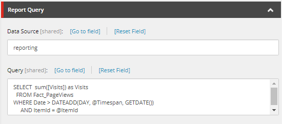

You probably have on sites with pages that show how often these are visited. This is done to show visitors that the page has attracted more people to read it and encourages them to read the article as well. This blogpost has been written using Sitecore 8.2. In older versions of Sitecore, different solutions can be used.

## Sitecore Analytics

Included in Sitecore, are the analytics. Out-of-the-box Sitecore tracks users and their behavior. In the xDB there’s a collection database that stored the experience data and in the SQLServer there’s a reporting database that stores all the aggregated reporting data. Sitecore automatically syncs the collection database to the aggregated reporting database by the aggregation pipeline.

Using the Sitecore reporting database
The Sitecore analytics API comes with some handy features to achieve this with the reporting database. We need some templates and a little code to do the trick. First of all we need to create an item of the template; `/sitecore/templates/System/Analytics/ReportQuery`. Where you create this item is up to you. I prefer to create this under `/system/settings/[layer]/[module]` in a Helix architecture.

This item contains two field that are important. Data Source; this field is filled with reporting and referrers to the database we are accessing with this query. Second is the query field. In this field we put the SQL query that will be executed on the reporting database.

```sql
SELECT sum([Visits]) as Visits
  FROM Fact_PageViews
 WHERE Date > DATEADD(DAY, @Timespan, GETDATE())
   AND ItemId = @ItemId
```

If we look at the query we see that the table Fact_PageViews is used. The parameters that go into the query are @Timespan and @ItemId. @ItemId will be the item id of the page we want to measure, @Timespan is the number in days we want to look in the history. In my case this is an requirement to show number of visits of the last x days. Be aware this has to be a negative number.



Having done all this, your item will look like above. Next is to create some code that will execute the query. We created a class derived from ItemBasedReportingQuery. In fact we are making a small item based report. In the snippet you see my piece of code.

```csharp
public class VisitsQuery : ItemBasedReportingQuery
{
  public static ID ItemVisits = new ID("{913D5098-0484-4FEB-B352-A61AC9B482A8}");
  public VisitsQuery(ReportDataProviderBase reportProvider = null)
   : base(ItemVisits, reportProvider)
  {
  }
  public ID ItemId { get; set; } 
  public int Timespan { get; set; } 
  public long Visits { get; protected set; } 

  public override void Execute()
  {
    var parameters = new Dictionary<string, object>
    {
      {
        "@ItemId", ItemId
      },
      {
        "@Timespan", Timespan
      }
    };

    var dt = this.ExecuteQuery(parameters);

    if (dt != null && dt.Rows.Count > 0)
    {
      var result = dt.Rows[0]["Visits"];
      if (result != null && result != DBNull.Value)
        Visits = (long)dt.Rows[0]["Visits"];
    }
  }
}
```

In this code you see the ID ItemVisits. This guid referrers to the item we created before. The parameters are passed into a dictionary and the query is being executed. The result is been put into a property than can be accessed afterwards.

Next is to use the query. This can be done everywhere you want.

```csharp
private static long PageViews(ID itemId, int timespan)
{
  var provider = (ReportDataProvider)Factory.CreateObject("reporting/dataProvider", true);
  var query = new VisitsQuery(provider)
  {
    ItemId = itemId,
    Timespan = timespan
  };

  query.Execute();
  return query.Visits;
}
```

Here we create a ReportDataProvider. The newly created query is called and the parameters are passed into it. After executing the number of visits are available.

Always think about performance and the data freshness you need when using this solution. Executing this piece of code is not slow, but to achieve best performance don’t do it on every pagerequest, that’s a bad practice.
