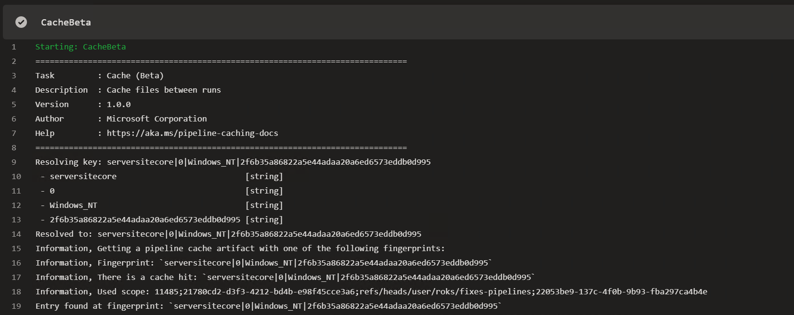
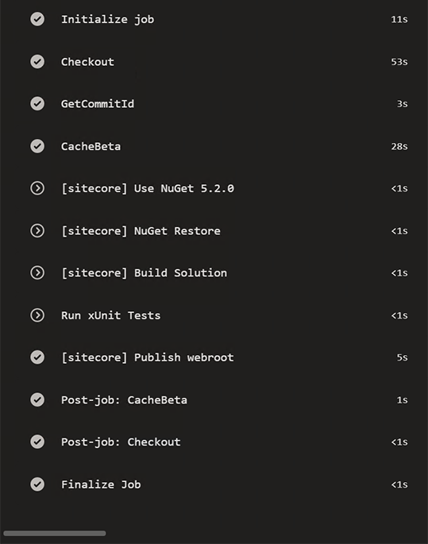

Last period I'm working in a monorepo. With a monorepo I mean, we choose to put all the code of an entire website in one repository. This code contains NET code for Sitecore, Angular single page apps, styling with Sass and some migrated legacy code from AngularJS. Yes, even the legacy code is in the repository.

## As it happened

At the beginning this kind of repository starts small, but after a few months it starts growing, and growing. All the problems that you'll find on the internet about monorepos arise. In this post I'll describe how we tried to solve the build performance that was rising to over an hour to manage it back to be on average on 12 minutes.

## Situation report

As mentioned before the repository consists .NET, Angular, AngularJS and Sass code. All have their specifics. The .NET code is one big solution with a growing number of projects, at the moment of writing this, it's at 90 projects. Many of them are not related to each other, as we follow the [Helix principles of Sitecore](https://helix.sitecore.net).

The Angular code, is brand new and uses NX to optimize all building and testing tasks. Angular uses a lot off Node modules, which is heavy on Windows, but working nicely on a Linux environment. This last is also applicable for Sass and AngularJS code.

## Use the right hardware for the job

Building a .NET solution with MSBuild can be done with a lot off flags, one off them is to use all the core on the build agent. One requirement, you'll need cores. Cores come with money off course, but on a Sitecore Helix based solution, more cores is better. Typically I would go for at least 8 cores.

Build clientside code, like Angular or Sass is a quit different story. In this case all the cores on your Windows build agent will lose it from a much cheaper Linux build agent. We had a 8 cores Windows build agent, which was slower than the 2 core hosted Ubuntu build agent of Azure DevOps. In case of money, build your clientside code on a Linux based environment. That's why these guys work on a MacBook, not only because it's fancy. If you here for a 2 or mores cores, it depends on your needs, the more is better. But keep in mind that not all node task runner support multi core when running there tasks. If you want to run multi-core, take a look at [Nx](https://nx.dev).

## Minimize network traffic

On a build agent you want as least as possible network traffic. Network traffic costs time and time is what we want to save. A few tips on this:

* Use `git fetch depth 1`, as a monorepo can get really large, we often still need just the latest version of the code to build.
* Use `npm ci` instead of `npm install`, [see this link](https://blog.npmjs.org/post/171556855892/introducing-npm-ci-for-faster-more-reliable)
* Use npm install argument `--no-audit` and `--prefer-offline`, they both save a lot of network traffic. If you really want to do an audit on your npm package run a separate task npm audit to show all your vulnerabilities, but not every npm install.

For more information on how to get best performance with NPM check [this blog](http://www.tiernok.com/posts/2019/faster-npm-installs-during-ci/)

## Use the right strategy for the job

Building a pipeline for a monorepo can be challenging. Think about what can be done in parallel and what must be sequential. In case of monorepo with .NET, Angular, Sass and AngularJS code, nothing really depends on other artifacts. Who is responsible for the final deploy package? Usually we would say it's the .NET build, where as we deploy it to a Azure WebApp as a Webdeploy package.

First challenge over here, how do we make one package of those 90+ web application projects. Let's first start by not creating 90 webdeploy packages, but let all the projects publish their artifacts to disk e.g. `$(Build.ArtifactStagingDirectory)\wwwroot`. Later on we will use this again.

Next challenge: how are we going to get all the compiled Sass and Angular code fitting in this picture. This code is not part of the .NET code structure, but lives in separate folders in the repository.

This can de done by using the wpp.target files as a wrote before in [this previous blog post](/using-wpp-targets-file-together-sitecore). However, this make the .NET code dependent on all the clientside code. This is not what you want, because it makes things slow.
We solve this by using a .NET core project. In this project we have ItemGroups describing the mapping between the clientside dist folders and the webroot. With a `dotnet publish -o <path>` to the webroot folder all files will be copied to the webroot folder.

```xml
<ItemGroup Label="Angular Apps">
  <Content Include="..\..\..\..\client\angular\dist\apps\\**" CopyToPublishDirectory="PreserveNewest"
           Link="assets\scripts\apps\%(RecursiveDir)%(Filename)%(Extension)" />
</ItemGroup>
```

## Azure DevOps tasks and API's

The last piece of this puzzle is Azure DevOps and it's features we can use to run in an optimal way.

### DevOps Yaml pipelines

To run in an optimal way we use the relative new Yaml pipelines in Azure DevOps. All what we do can also be achieved in classic mode, but I prefer Yaml.

In this Yaml pipeline there are several split-ups to make. The most important here are jobs. Jobs can be dependent of each other. If you do not specify this dependency they will run in parallel, if possible. You must be able to run multiple agents at the same time.
All the different code chunks we have, .NET, Angular, Sass, AngularJS run in different jobs. In a job we can specify the agent pool on which this job need to run. For .NET we choose the 8 cores Windows machine, for clientside jobs the Ubuntu 2 core machines.
At the end we create one job to merge it all together and create a web deploy package of it.

### Pipeline Artifacts

Pipeline artifacts is a task and will be de successor of the Publish Build Artifacts task. It's blazing fast and uses new techniques to achieve this. We will use it at the end of all separate jobs to upload the output. Even on a .NET webroot of 130MB it's a matter of seconds to upload this. In the merge job on the end, the download pipeline artifacts task is used. This download the artifact amazingly fast as well.

### Cache Beta

This task is at the time of writing this blog still in preview. Following [the documentation](https://docs.microsoft.com/en-us/azure/devops/pipelines/caching/?view=azure-devops) we should use this to cache the NPM cache. This is done by upload the cache at the end of the job and download it again at a repetitive run, when the key, which you can provide is the same. In my test runs. This explained scenario didn't give me many benefits.

### Optimize the optimizing task

When reading the previous, DevOps is trying to optimize the NPM install. But what is faster than a fast npm install? Don't execute the NPM install when it is not needed. But how do we know it is not needed?

In git a folder shows the last commit id that is made in that folder, recursively. With this in mind we can use the commit id as a cache key of the Cache Beta task. If we can cache even the build output, we do not have to execute the npm install/NuGet restore and all related build tasks. Not having to execute the tasks is always faster than needing to execute them.



How can we get the commit ids of folders? A good approach for this is to use the [Azure DevOps API](https://docs.microsoft.com/en-us/rest/api/azure/devops/?view=azure-devops-rest-5.1). This API is as big as DevOps itself. Put this API call in a Powershell script and combine it with the Cache Beta task. For that a Yaml step template can be used in all jobs.

```yaml
parameters:
  path: ''
  artifact: ''
  key: '0'
  outputPath: ''
  cacheHit: ''

steps:
- powershell: |
   function GetCommitId([string] $path)
   {
     $branch = $env:BUILD_SOURCEBRANCH
     $branch = $branch -replace "refs/heads/", ""
     $repository = $env:BUILD_REPOSITORY_NAME
     $currentCommitId = $env:BUILD_SOURCEVERSION
     [uri] $DevOpsRestCommitUri = $env:SYSTEM_TEAMFOUNDATIONCOLLECTIONURI + "/" + $env:SYSTEM_TEAMPROJECT + "/_apis/git/repositories/$repository/commits?searchCriteria.itemPath=$path&api-version=5.1&searchCriteria.itemVersion.versionType=commit&searchCriteria.itemVersion.version=$currentCommitId&top=1"
     Write-Host $DevOpsRestCommitUri
     $Response = Invoke-RestMethod -Uri $DevOpsRestCommitUri `
           -Method Get `
           -ContentType "application/json" `
           -Headers @{Authorization = "Bearer $env:SYSTEM_ACCESSTOKEN"}
     return $Response.value[0]. commitId
   }
   $paths = "${{ parameters.path }}"
   $option = [System.StringSplitOptions]::RemoveEmptyEntries
   $paths.Split(";",2, $option) | ForEach {
    $commitId += GetCommitId -path $_
   }
   $commitVar = "${{ parameters.artifact }}_commitId"
   Write-Host "##vso[task.setvariable variable=$commitVar]$commitId"
  displayName: GetCommitId
  env:
    SYSTEM_ACCESSTOKEN: $(system.accesstoken)
- task: CacheBeta@1
  displayName: CacheBeta
  inputs:
    key: '${{ parameters.artifact }} | ${{ parameters.key }} | $(Agent.OS) | $(${{ parameters.artifact }}_commitId)'
    path: '${{ parameters.outputPath }}'
    cacheHitVar: '${{ parameters.cachehit }}'
```

The cachehit parameter that will we used as a cacheHitVar, can be used as a condition on all consequtive tasks.


## Merging all together

When all code is build and all have upload their artifacts, the merge job will start. Here it starts with downloading all pipeline artifacts. The .NET code will be download at a folder that will serve as the webroot folder. After that the .NET Core publish will be executed to get all the clientside artifacts in the right place of the webroot. Note, that this project also can be used during development mode.

When everything is in place we create a web deploy package of it all, again with a Powershell script.

```powershell
param(
   [Parameter(Mandatory=$True)]
   [string]$WebRootFolder,
   [Parameter(Mandatory=$true)]
   [string]$ParametersXmlFile,
   [Parameter(Mandatory=$true)]
   [string]$OutputFile
)
Write-Host "create msdeploy package from extracted files"
$msdeploy = "C:\Program Files\IIS\Microsoft Web Deploy V3\msdeploy.exe"
$verb = "-verb:sync"
$source = "-source:iisApp="$WebRootFolder""
$declareParam = "-declareparam:name="IIS Web Application Name",kind=ProviderPath,scope=IisApp,match="
$declareparamfile = "-declareparamfile="$ParametersXmlFile""
$escapedWebRootFolder = $WebRootFolder.Replace("\","\\")
$replace = "-replace:match='$escapedWebRootFolder',replace='website'"
$destination = "-dest:package="$OutputFile""
Write-Host "invoking msdeploy"
Invoke-Expression "& '$msdeploy' --% $verb $source $destination $declareParam $declareparamfile $replace"
```

Hope it helps!
