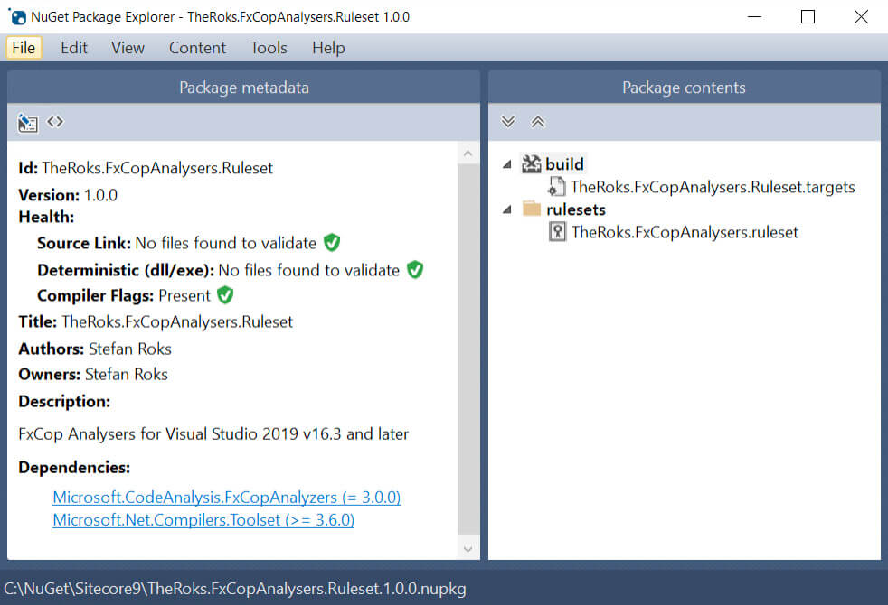

In the last years many changes were made to the way Microsoft handles Code Quality in Visual Studio. Like all other movements of Microsoft, these changes follow more open-source and everybody else is doing things.

## #TLDR

We distribute the ruleset by using a custom created NuGet package. This package includes:

* the ruleset
* a dependency reference to Roslyn analysers used in the ruleset

To apply the ruleset, a targets file is used.

## Migrate Code Analysis to FxCop analysers

Back in the days we had Code Analysis in Visual Studio. Starting from the first versions of Visual Studio, this was the Static Code analyzer. With the rise of NuGet and later .NET Core, things are changing, also in the .NET Framework. Roslyn was introduced and FxCop analysers came. First as an extension on Visual Studio 2010 and later incorperated into Visual Studio.

FxCop analysers are the successors of Code Analysis. These analysers use the Roslyn compiler which gives a great experience in Visual Studio. Realtime Static code analysis in Visual Studio is born.

With the release of Visual Studio 2019 Code analysis is being marked deprecated in the interface. Time to move on! Let’s migrate to FxCop analysers.

FxCop analysers can be used in two ways: Install as an extension in Visual Studio or use NuGet. When you work in a development team NuGet is the preferred way. In team environments, analyzers installed as NuGet packages are in scope for all developers that work on that project. However you'll need to install them on every project in your solution.

## The anatomy of NuGet package

NuGet holds some special folders. We’ll use the **build** folder. In this folder we place a [targets file](https://docs.microsoft.com/en-us/visualstudio/msbuild/msbuild-dot-targets-files?view=vs-2019). The reference to the targets file is placed at the end of the project file. If you would use a props file, it would be placed at the beginning of the project file. By placing it at the end, it will overrule the current settings in the project file. That's is exactly what we want in this case. The contents of my target file contains the following:

```xml
<?xml version="1.0" encoding="utf-8"?>
<Project ToolsVersion="10.0" xmlns="http://schemas.microsoft.com/developer/msbuild/2003">
  <PropertyGroup>
    <CodeAnalysisRuleSet>$(MSBuildThisFileDirectory)\..\rulesets\TheRoks.FxCopAnalysers.ruleset</CodeAnalysisRuleSet>
  </PropertyGroup>
</Project>
```

Besides the targets file we need to place the ruleset file containing our [custom created ruleset](https://docs.microsoft.com/en-us/visualstudio/code-quality/using-rule-sets-to-group-code-analysis-rules?view=vs-2019).

Next, the dependencies. Include the ```Microsoft.CodeAnalysis.FxCopAnalysers``` and ```Microsoft.Net.Compilers.Toolset``` NuGet packages in there.
In the end your NuGet package will look like this 
Beaware of the Microsoft.Net.Compilers.Toolset package. It start with version 3.6 in the NuGet feeds. This package is the successor of the Microsoft.Net.Compilers and Microsoft.NETCore.Compilers and brings the .NET Framework and .NET Core together.
For now you're ready to go. However this post continues with upcoming changes from Microsoft 😎.

## The version dependency hell

Every now and then new versions of Visual Studio, C# appear. These upgrades often come with upgrades for the NuGet packages you can include in your projects. Always be aware which version to use in your situation. Here some links from Microsoft:

* [Roslyn version support](https://docs.microsoft.com/en-us/visualstudio/extensibility/roslyn-version-support?view=vs-2019)
* NuGet: [Deprecated Microsoft.Net.Compilers](https://www.nuget.org/packages/Microsoft.Net.Compilers)
* NuGet: [Microsoft.Net.Compilers.Toolset](https://www.nuget.org/packages/Microsoft.Net.Compilers.Toolset)

## More changes upcoming

Oh yes, Microsoft isn’t finished changing things here. By now they already called the [ruleset file to be deprecated](https://docs.microsoft.com/en-us/visualstudio/code-quality/use-roslyn-analyzers?view=vs-2019#convert-an-existing-ruleset-file-to-editorconfig-file) in favour of the ```.editorconfig``` file. It is understandable from the point of view to use more open standards. However, using the .editorconfig is very different from using the ruleset file in a NuGet package.

The .editorconfig file depends on file locations as it must be in the folder of a sourcefile or any parent folder. Using these locations implies that it will be commited to a repository. The ruleset file lives in a packages folder and will never be commited to your repository.

By migrating to a .editorconfig file, you will lose centralized control over the ruleset as it is commited to your repository.

Should you use the .editorconfig already? You could. When you have no other projects using the same ruleset. When you want to share one ruleset over many projects, NuGet is much more powerful and easy to manage.

We'll see what the future brings.
