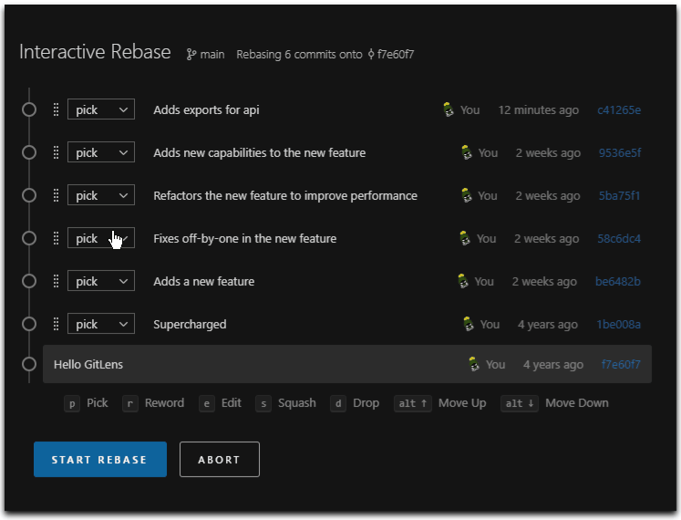

After working with git for years now. I still learn new things. Git has a lot of options, some are easy to use, some are complicated, and very powerfull. A short resume on usefull git possibilties.

## Squash and merge

It is very useful when we are working on a feature branch and we have done so many commits for a single feature now we want to merge this to master.
We can do that but as there are so many commits which are not even useful for the master so the better way is to squash them into the single commit and that commit will be merged in the master.

```bash
git checkout master
git merge feature —-squash
```

## Git rebase

The major benefit of rebasing is that you get a much cleaner project history. First, it eliminates the unnecessary merge commits required by git merge. Second,  rebasing also results in a perfectly linear project history—you can follow the tip of dev all the way to the beginning of the project without any forks. This makes it easier to navigate your project with commands like git log, git bisect and gitk.

Never do the rebase on public branches like the master as it can be potentially catastrophic for your collaboration workflow. And, less importantly, rebasing loses the context provided by a merge commit—you can’t see when upstream changes were incorporated into the feature.

So, before you run git rebase, always ask yourself, “Is anyone else looking at this branch?” If the answer is yes, take your hands off the keyboard and start thinking about a non-destructive way to make your changes, like doing a git merge.

### When to use Rebase?

1. Local cleanup and you can rebase your branch with the master branch.
2. Can do the rebasing if you are pulling someone else feature or two devs are working on the same branch as it will create linear history.

## Git rebase interactive

Interactive rebasing gives you the opportunity to alter commits as they are moved to the new branch. This is even more powerful than an automated rebase, since it offers complete control over the branch’s commit history. Typically, this is used to clean up a messy history before merging a feature branch into master.

```bash
git checkout feature git rebase -i master
```

This will open a text editor listing all of the commits that are about to be moved:

```bash
pick 33d5b7a Message for commit #1
pick 94f0b3d Message for commit #2
pick 5ca7e61 Message for commit #3
```

This listing defines exactly what the branch will look like after the rebase is performed. By changing the pick command and/or re-ordering the entries, you can make the branch’s history look like whatever you want. For example, if the 2nd commit fixes a small problem in the 1st commit, you can condense them into a single commit with the fixup command:

```bash
pick 33d5b7a Message for commit #1
fixup 94f0b3d Message for commit #2
pick 5ca7e61 Message for commit #3
```

When you save and close the file, Git will perform the rebase according to your instructions.

After completing a rebase you'll always have to do a force push to the remote branch. This is because you are rewriting existing commits. Make sure in your remote repository you can only make force pushes on branches that you own and explicit revoke this permission on public branches.

VSCode has an extension, GitLens which makes it easier to interactive rebase.



### Conflicts

When working on long running branches, you'll do more than one rebase on your branch. To prevent you'll have to resolve the same conflicts over and over again, enabled the git feature: Reuse recorded resolution. This will record and reuse previous conflicts resolutions.

```bash
git config --global rerere.enabled true
git config --global rerere.autoupdate true
```

Your `.gitconfig` file will look like this

```bash
[rerere]
  enabled = true
  autoupdate = true
```

## Git Alias

Another way to ease your git life, is to have some aliases for commands or command squences you ofen use. Aliases can be defined in a `.gitconfig` file.

```bash
[alias]
  unstage = reset --soft HEAD^
  puf = !git push origin `git branch --show-current` -f
  amend = !git add --all && git commit --amend --no-edit
```

## Tooling

To setup VSCode as default editor for all git commands. Run this command

```bash
git config --global core.editor "code --wait"
```

To use VSCode as diff and mergetool put this configuration in your `.gitconfig` file

```bash
[core]
  editor = code --wait
[diff]
  tool = vscode
[difftool "vscode"]
  cmd = code --wait --diff $LOCAL $REMOTE
[merge]
  tool = vscode
[mergetool "vscode"]
  cmd = code --wait $MERGED
```
